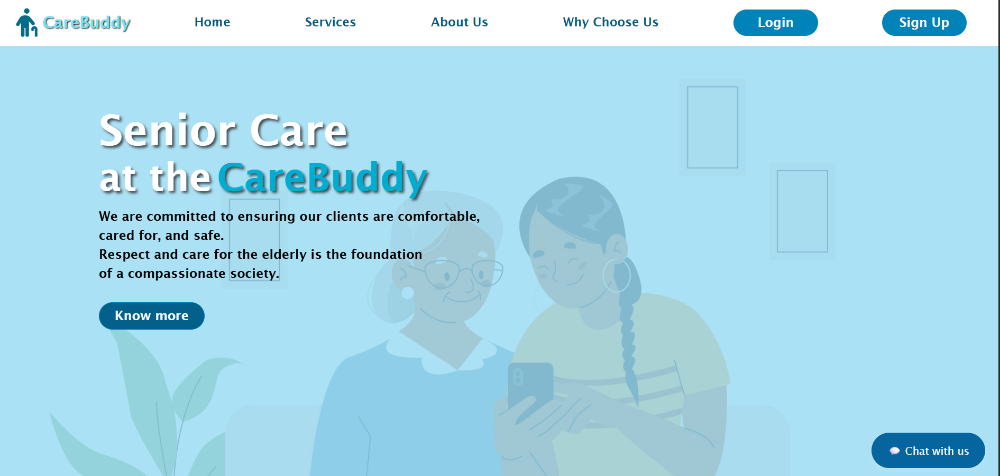
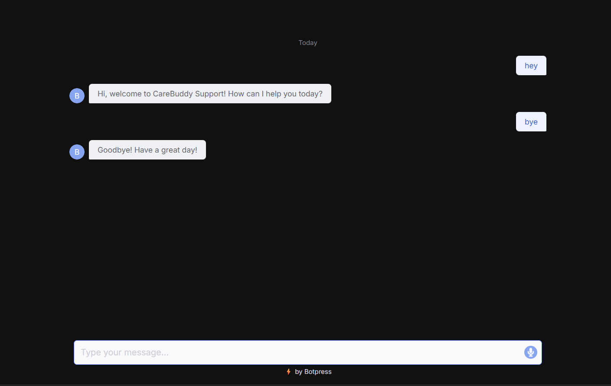
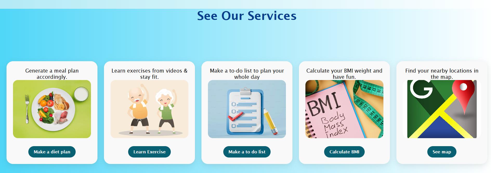
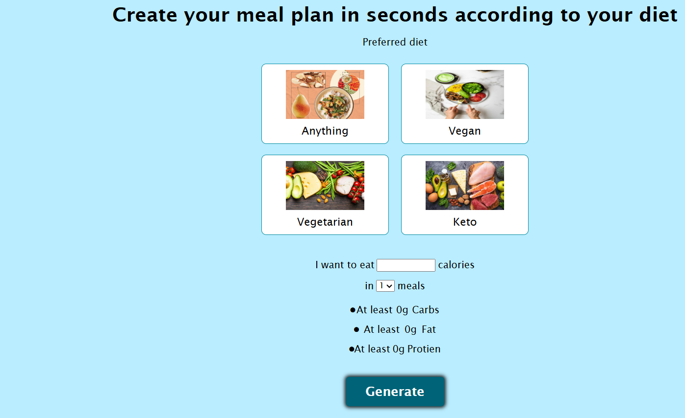

 # 🧓💙 CareBuddy

CareBuddy is a web application designed to assist elderly individuals in managing their daily routines, health, and overall well-being. With a clean, user-friendly interface and essential features, CareBuddy promotes independence, healthy living, and ease of use for senior users.

---

## 🗂️ Project Overview

Aging often brings challenges in managing day-to-day tasks and maintaining health. **CareBuddy** addresses these challenges with a centralized, accessible platform designed specifically for elderly care. Whether it’s tracking tasks, generating diet plans, or finding nearby healthcare facilities — CareBuddy is here to help.

---

## ✨ Features

- 🧠 **AI Chatbot**  
  An intelligent assistant to answer common health and lifestyle-related questions.

- 🧘‍♂️ **Exercise Routines**  
  Curated and linked YouTube videos for safe and simple exercises tailored to older adults.

- 🥗 **Diet Generator**  
  Personalized diet plans to support balanced nutrition and health goals.

- 📍 **Google Maps Integration**  
  Find nearby hospitals, pharmacies, and clinics with ease.

- 📝 **To-Do List**  
  Simple task tracking and reminders for daily routines.

- ⚖️ **BMI Calculator**  
  Calculate and monitor Body Mass Index with an easy-to-use tool.

- 🎨 **Smooth Animations**  
  Engaging UI with accessible and calm transitions.

---

## 🛠️ Tech Stack

- **Frontend**: HTML, CSS, JavaScript, Bootstrap  
- **APIs & Tools**: Google Maps API, YouTube (for embedded videos)  
- **Design**: Figma

---

## 🚀 How to Run the Project

### 1. Clone the Repository

```bash
git clone https://github.com/sakshipriya10/SheCodess


## 📸 Screenshots

### 🏠 Home Page


### 💬 Chatbot


### 🧘‍♀️ Services Section


### 🥗 Diet Generator



🧑‍💻 Team
This project was built with ❤️ for the ByteVerse Hackathon by:

Arti kumari
Sakshi Priya
Sunidhi Kumari